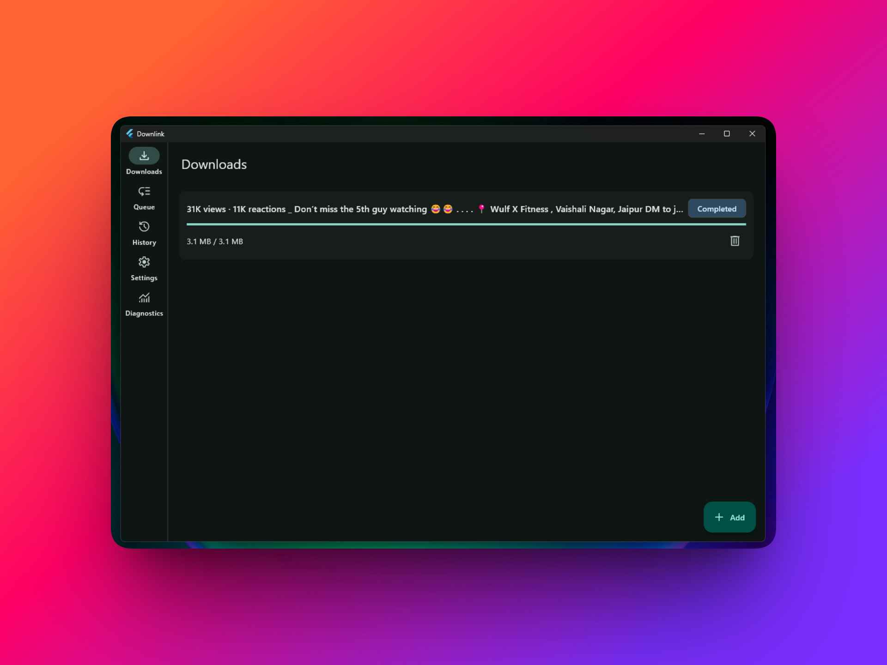
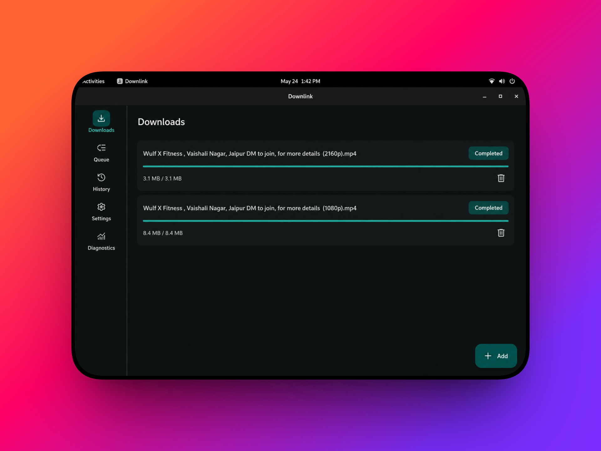
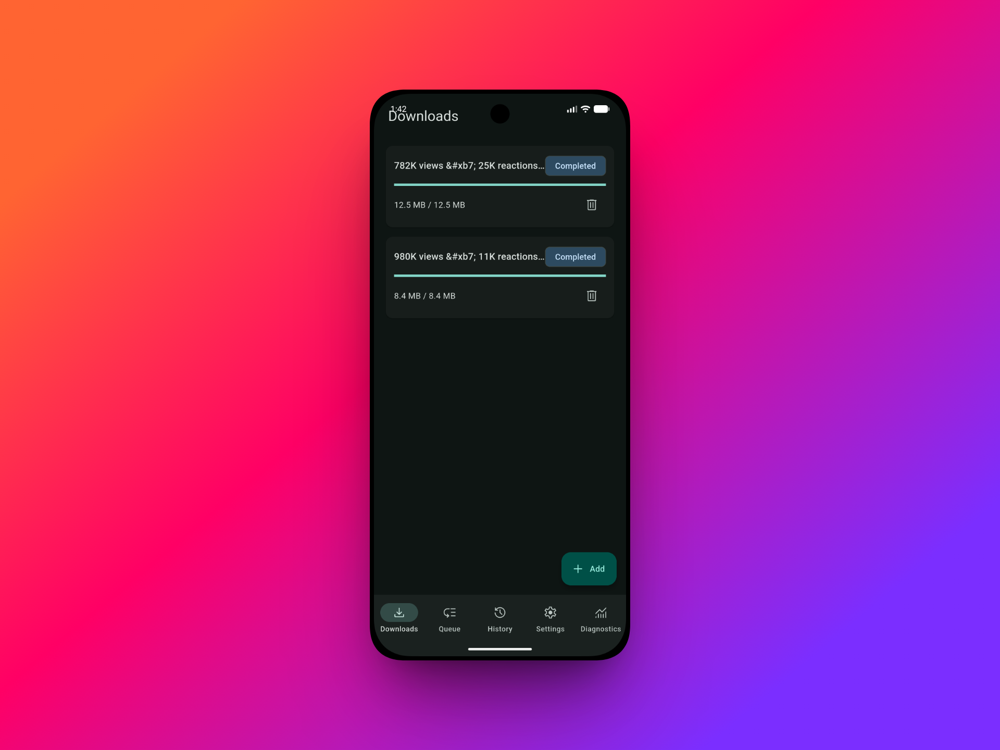

<p align="center">
  
</p>

<h1 align="center">Downlink</h1>

<p align="center">
  <strong>Fast, open source download manager for Windows, Linux &amp; Android.</strong>
</p>

<p align="center">
  Pause, resume, and queue downloads with browser handoff, video extraction,
  and torrent support — built by
  <a href="https://geonode.com">Geonode Labs</a>.
</p>

<p align="center">
  <a href="LICENSE"></a>
  <a href="https://github.com/geonodecom/downlink/releases/latest"></a>
  <a href="https://github.com/geonodecom/downlink/releases"></a>
  <a href="https://github.com/geonodecom/downlink/actions/workflows/ci.yml"></a>
  <a href="https://github.com/geonodecom/downlink/stargazers"></a>
</p>

<p align="center">
  <a href="https://github.com/geonodecom/downlink/releases/latest"><strong>Download for Windows</strong></a>
  ·
  <a href="https://github.com/geonodecom/downlink/releases/latest"><strong>Download for Android</strong></a>
  ·
  <a href="#linux"><strong>Install on Linux</strong></a>
</p>

## Features

- Accelerated, resumable HTTP downloads with pause, retry, and reorder
- Configurable download queue (one-active by default)
- Chromium extension handoff on desktop; share / open-with on Android
- YouTube, Facebook, Instagram, and TikTok single-video downloads with format selection
- Magnet and `.torrent` downloads with seeding controls
- Android foreground service with progress notifications
- SQLite-backed history, queue, and settings across platforms

## Screenshots

<p align="center">
  
  &nbsp;
  
</p>

<p align="center">
  
</p>

## Install

### Windows

1. Open the [latest GitHub Release](https://github.com/geonodecom/downlink/releases/latest).
2. Download **`Downlink-Setup-<version>.exe`** and run it.
3. The installer is per-user (no admin prompt), installs to `%LOCALAPPDATA%\downlink`, creates a Start Menu shortcut, and registers browser native messaging.

**Portable option:** download `downlink-<version>-windows-x64-portable.zip`, extract the whole archive, and run `downlink.exe` from that folder. Do not move `downlink.exe` alone — Flutter DLLs, `data/`, and `bin/` must stay beside it.

### Android

1. Open the [latest GitHub Release](https://github.com/geonodecom/downlink/releases/latest).
2. Download **`downlink-<version>.apk`** and install it (sideload / allow unknown apps as needed).
3. Official builds currently use debug signing for local install; Play Store distribution is not the primary path yet.

### Linux

Linux release packages are not published yet. Build and install from source:

```sh
make install
```

This installs under `~/.local/share/downlink`, creates `~/.local/bin/downlink`, and sets up the desktop entry plus native messaging host. See [docs/development.md](docs/development.md) for build-host dependencies.

## Supported downloads

| Type | Notes |
| --- | --- |
| Direct HTTP / HTTPS | Pause, resume, segmented downloads |
| YouTube | Watch, Shorts, live, embed, music, playlists |
| Facebook / Instagram / TikTok | Single videos and reels; private access via session cookies |
| Magnet / `.torrent` | Downloads all files; seeding controlled in Settings |

**Limitations:** Instagram photo posts and carousels, TikTok slideshows/live/playlists, and per-file torrent selection are not supported. Private social videos need cookies (Android in-app login or desktop cookies.txt / browser import). Keep desktop yt-dlp on the nightly channel for reliable TikTok extraction.

## Built by Geonode Labs

Downlink is an open source project from
[Geonode Labs](https://geonode.com) — the team behind Geonode proxy infrastructure.

## Contributing

Bug reports, feature ideas, and pull requests are welcome. Start with
[CONTRIBUTING.md](CONTRIBUTING.md), and please follow the
[Code of Conduct](CODE_OF_CONDUCT.md).

Security issues should be reported privately — see [SECURITY.md](SECURITY.md).

## License

[MIT](LICENSE)

## Development

Build, run, extension setup, platform engines, and release packaging are documented in
[docs/development.md](docs/development.md).
